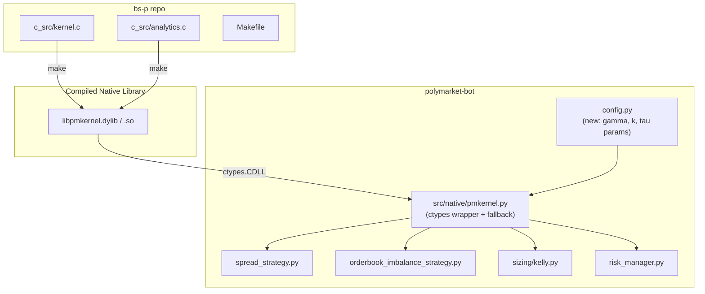

# bs-p Integration Plan: Rust/C Math Engine into Polymarket Bot

---

## 1. Architecture Overview

At runtime, the Python bot loads a pre-compiled shared library (`libpmkernel.dylib` on macOS / `libpmkernel.so` on Linux) built directly from bs-p's C source files. A single Python wrapper module (`src/native/pmkernel.py`) provides typed functions that convert numpy arrays to C pointers via `ctypes`. Each strategy imports from this wrapper instead of doing its own math. If the native library is not found at startup, every function falls back to the existing pure-Python implementation.




**Data flow per scan cycle:**

1. Bot fetches market data (Gamma API) and orderbook (WebSocket/REST) as today
2. For each market under consideration, strategies call `pmkernel.`* functions instead of inline math
3. All C calls are batch-oriented (SoA `double`* arrays), but work fine with `n=1` for single-market calls
4. Results (bid/ask prices, Kelly clips, OBI signals, Greeks) feed back into the existing Signal/Order pipeline unchanged

---

## 2. Bridge Approach: ctypes (Recommended)

**Recommendation: `ctypes` with direct C shared library compilation.**


| Criterion         | ctypes                              | cffi                            | PyO3 + maturin           |
| ----------------- | ----------------------------------- | ------------------------------- | ------------------------ |
| New Python deps   | **None** (stdlib)                   | cffi                            | maturin, PyO3            |
| New Rust deps     | None                                | None                            | PyO3 crate               |
| Build complexity  | One `cc` command                    | Moderate                        | High (maturin wheel)     |
| numpy interop     | `arr.ctypes.data_as()` — zero-copy  | `ffi.from_buffer()` — zero-copy | Need ndarray crate       |
| Maintenance       | ~80 lines of wrapper code           | ~60 lines                       | ~200 lines Rust + Python |
| Graceful fallback | `try: CDLL(...)` / `except OSError` | Same                            | Import error handling    |


**Why ctypes wins here:**

- **Zero new dependencies.** The bot stays lean. `ctypes` and `numpy` are already available.
- **The C API is trivially simple.** All functions take `const double`* arrays + `size_t n` and write to `double`* output arrays. This is the exact use case ctypes was designed for.
- **numpy integration is zero-copy.** `np.array(..., dtype=np.float64).ctypes.data_as(POINTER(c_double))` passes array pointers directly to C with no copying.
- **Decoupled from Rust.** The C math code (`kernel.c`, `analytics.c`) is self-contained. Compiling it as a shared library requires only a C compiler, not the Rust toolchain. This means the Python bot can be deployed on machines without `rustc`.
- **Future-compatible.** If bs-p adds new Rust-only functions later, we can reassess PyO3 at that point. The ctypes wrapper is a thin layer that's easy to replace.

**Why not PyO3:** The Rust `lib.rs` is just a pass-through wrapper over the C functions — no Rust-specific logic. Introducing PyO3 would add maturin as a build dependency, require a new crate, and force the Rust toolchain into the Python deployment pipeline, all to re-export functions that are already C ABI. Not justified.

---

## 3. Build Pipeline

### 3.1 Compile the C shared library

Add a `Makefile` to `bs-p/`:

```makefile
CC ?= cc
CFLAGS = -shared -fPIC -O3 -Ic_src
SRCS = c_src/kernel.c c_src/analytics.c
UNAME := $(shell uname)

ifeq ($(UNAME), Darwin)
  TARGET = libpmkernel.dylib
else
  TARGET = libpmkernel.so
  # Auto-detect AVX-512 (Linux only — macOS/ARM never has it)
  ifneq ($(wildcard /proc/cpuinfo),)
    ifneq ($(shell grep -c avx512f /proc/cpuinfo),0)
      CFLAGS += -mavx512f
    endif
  endif
endif

$(TARGET): $(SRCS) c_src/kernel.h c_src/analytics.h
	$(CC) $(CFLAGS) -o $@ $(SRCS) -lm

clean:
	rm -f libpmkernel.dylib libpmkernel.so

.PHONY: clean
```

Build: `cd bs-p && make` produces `libpmkernel.dylib` (macOS) or `libpmkernel.so` (Linux).

### 3.2 Make the library discoverable from polymarket-bot

Two options (implement both, search in order):

1. **Symlink/copy into polymarket-bot:** `cp ../bs-p/libpmkernel.dylib polymarket-bot/lib/` and load from a relative path
2. **Environment variable:** `PMKERNEL_LIB_PATH=/path/to/libpmkernel.dylib`

The wrapper module (`src/native/pmkernel.py`) searches: env var -> `lib/` subdir -> system library path -> graceful fallback.

### 3.3 Build script in polymarket-bot

Add a `scripts/build_native.sh`:

```bash
#!/bin/bash
# Build bs-p native library and install into polymarket-bot/lib/
BSP_DIR="${BSP_DIR:-$(dirname "$0")/../../bs-p}"
cd "$BSP_DIR" && make
mkdir -p "$(dirname "$0")/../lib"
cp "$BSP_DIR"/libpmkernel.* "$(dirname "$0")/../lib/" 2>/dev/null
```

No pip wheel, no maturin, no setup.py. Just `make` and `cp`.

---

## 4. Parameter Mapping

### 4.1 `spread_strategy.py` -> `calculate_quotes_logit`

This is the highest-impact swap. The current strategy uses crude `bid + price_improvement/100` as entry and `ask` as exit. bs-p's Avellaneda-Stoikov engine computes theoretically optimal bid/ask quotes that account for inventory risk, volatility horizon, and market depth.


| bs-p param | Type                   | Source in bot                           | Derivation                                                                                                                                                                                                                                                             |
| ---------- | ---------------------- | --------------------------------------- | ---------------------------------------------------------------------------------------------------------------------------------------------------------------------------------------------------------------------------------------------------------------------- |
| `x_t`      | logit of mid           | `data.mid_price`                        | `kernel_logit(data.mid_price)`                                                                                                                                                                                                                                         |
| `q_t`      | inventory (shares)     | `risk_manager.positions[token_id].size` | Positive = long, negative = short. Use 0.0 for no position.                                                                                                                                                                                                            |
| `sigma_b`  | belief volatility      | Bootstrap from market                   | On startup: `implied_belief_volatility_batch(bid, ask, ...)` on all active markets. During runtime: exponential moving average of recent implied vols. Alternatively, map from `binance_feed.volatility_5m` via a calibration factor.                                  |
| `gamma`    | risk aversion          | New config param                        | **Start at 1.0 for $304 bankroll** (conservative). Lower (0.3-0.5) tightens quotes = more aggressive. Higher (1.0-2.0) widens quotes = safer. Add `QUOTING_GAMMA` to config. Scale inversely with bankroll growth: `gamma = base_gamma * (300 / current_balance)^0.5`. |
| `tau`      | time to resolution     | `data.end_date_ts`                      | `max(0.001, (end_date_ts - time.time()) / 86400)` — fraction of a day remaining. For 5-min markets: ~0.003. For daily markets: 0.1-1.0.                                                                                                                                |
| `k`        | liquidity/arrival rate | `data.volume_24h`                       | Estimate: `k = volume_24h / 86400 * scan_interval`. For a market doing $100k/day: `k ~ 5.8`. **Start with `k = 2.0`** and calibrate by measuring actual fill rates. Add `QUOTING_K` to config.                                                                         |


**Output mapping:**

- `bid_p[0]` -> new `entry_price` (replaces `data.best_bid + price_improvement/100`)
- `ask_p[0]` -> new `exit_price` (replaces `data.best_ask`)
- Both are probabilities [0, 1] that can be used directly as limit order prices

**Key behavioral difference:** With inventory (`q_t > 0`, already long), the reservation price shifts down and spreads widen asymmetrically. The bid drops more than the ask rises. This means the strategy naturally reduces position size as inventory grows — exactly the "optimal auto-sizing" behavior requested.

### 4.2 `orderbook_imbalance_strategy.py` -> `order_book_microstructure_batch`

The current strategy has a weak spread-asymmetry fallback (lines 303-319 in [orderbook_imbalance_strategy.py](polymarket-bot/src/strategies/orderbook_imbalance_strategy.py)) that synthesizes a fake 1.0/1.0 volume from bid-ask position. bs-p computes proper OBI, VWAP mid, and directional pressure from actual order book volumes.


| bs-p param | Type             | Source in bot                                         | Notes                                                                                                                                                           |
| ---------- | ---------------- | ----------------------------------------------------- | --------------------------------------------------------------------------------------------------------------------------------------------------------------- |
| `bid_p`    | best bid price   | `data.best_bid`                                       | Direct mapping                                                                                                                                                  |
| `ask_p`    | best ask price   | `data.best_ask`                                       | Direct mapping                                                                                                                                                  |
| `bid_vol`  | total bid volume | `sum(level.size for level in orderbook["bids"][:10])` | **Requires orderbook data.** Currently `data.orderbook` is usually None because `_build_market_data()` in `bot.py` doesn't populate it. See prerequisite below. |
| `ask_vol`  | total ask volume | `sum(level.size for level in orderbook["asks"][:10])` | Same prerequisite                                                                                                                                               |


**Output mapping:**

- `out_obi` -> replaces hand-rolled `(bid_vol - ask_vol) / (bid_vol + ask_vol)` ratio
- `out_vwm_p` -> VWAP mid-price; use instead of `(bid + ask) / 2` for more accurate reference price
- `out_pressure` -> composite signal: `OBI + (VWAP_mid - arith_mid) / spread`; replaces the weak `bid_pull` heuristic
- `out_vwm_x` -> logit-space VWAP mid; useful for downstream `calculate_quotes_logit`

**Prerequisite:** Enable WebSocket feed (`ENABLE_WEBSOCKET_FEED=true`) and wire `OrderbookUpdate` data into `MarketData.orderbook` in `bot.py:_build_market_data()`. Alternatively, add REST orderbook fetch via the CLOB client. Without this, `bid_vol` and `ask_vol` are unavailable, and bs-p's microstructure analysis gives no improvement over the fallback. This is a **blocking dependency** for this integration point.

### 4.3 `kelly.py` -> `adaptive_kelly_clip_batch`

The current Kelly has no inventory awareness — it sizes based purely on edge and bankroll. bs-p's version scales position down as `|q_t|` grows, preventing over-concentration.


| bs-p param   | Type                    | Source in bot                           | Derivation                                                                                                                                                                         |
| ------------ | ----------------------- | --------------------------------------- | ---------------------------------------------------------------------------------------------------------------------------------------------------------------------------------- |
| `belief_p`   | estimated probability   | `estimated_prob` arg in `kelly_size()`  | Direct. Comes from each strategy's edge estimate.                                                                                                                                  |
| `market_p`   | market price            | `market_price` arg in `kelly_size()`    | Direct. This is `data.mid_price` or `data.best_bid`.                                                                                                                               |
| `q_t`        | current inventory       | `risk_manager.positions[token_id].size` | **New input.** Currently `kelly_size()` doesn't know about existing inventory. Wire the position lookup into the sizing call.                                                      |
| `gamma`      | risk aversion           | Same `QUOTING_GAMMA` config param       | Use the same gamma as the quoting engine for consistency.                                                                                                                          |
| `risk_limit` | max position allowed    | `risk_manager._get_max_position()`      | Already computed by adaptive risk: `current_balance * max_position_pct * throttle_factor`. Convert from USD to contract units: `risk_limit_contracts = risk_limit_usd / market_p`. |
| `max_clip`   | absolute max single bet | `KELLY_MAX_BET_FRACTION * bankroll`     | Currently 5% of bankroll = $15.20 at $304.                                                                                                                                         |


**Output mapping:**

- `out_taker_clip` -> replaces `kelly_fraction * bankroll` as the bet size for aggressive (taker) entries
- `out_maker_clip` -> new: conservative (maker) size = `0.5 * taker_clip`, use for passive limit orders
- These are in contract units, not USD. Multiply by price for USD sizing: `bet_usd = out_taker_clip * market_p`

**Key improvement:** With the current Kelly, if you have a $20 position and Kelly says bet $15 more, you bet $15. With bs-p's Kelly, `inventory_scale = 1 / (1 + gamma * |q_t|)` reduces the $15 to perhaps $8, reflecting that marginal risk increases with position size. This is the "optimal auto-sizing" the user wants.

**Integration into existing `KellyResult`:** The `kelly_size()` function should return an enhanced `KellyResult` with additional fields: `inventory_q`, `inventory_scale`, `maker_size_usd`, `taker_size_usd`. Existing callers that only read `bet_size_usd` continue to work.

### 4.4 `risk_manager.py` -> `aggregate_portfolio_greeks` + `simulate_shock_logit_batch`

This is additive, not a replacement. The existing drawdown throttle continues to work. Greeks monitoring and shock testing add a second layer.

**Portfolio Greeks (run every scan cycle):**


| bs-p param     | Source                                     | Notes                                                                                                             |
| -------------- | ------------------------------------------ | ----------------------------------------------------------------------------------------------------------------- |
| `positions[i]` | `risk_manager.positions.values() -> .size` | Array of position sizes across all markets                                                                        |
| `delta_x[i]`   | Compute via `kernel_greeks_batch`          | First convert each position's `current_price` to logit: `x = logit(pos.current_price)`, then batch-compute Greeks |
| `gamma_x[i]`   | Same as above                              | From `GreekOut.gamma_x`                                                                                           |
| `weights[i]`   | `NULL` (pass None -> all 1.0)              | Start with equal weights. Later: weight by position USD value                                                     |
| `corr_matrix`  | `NULL` initially                           | Later: build correlation matrix for 5-min BTC up/down/15min/1hr markets. These are highly correlated (~0.8-0.9).  |


**Output:** `net_delta` (portfolio directional exposure) and `net_gamma` (portfolio convexity). Display in TUI dashboard. Alert via Telegram if `|net_delta| > threshold`.

**Pre-trade shock test (before each order):**


| bs-p param      | Source                                                                            |
| --------------- | --------------------------------------------------------------------------------- |
| `x_t[i]`        | `logit(pos.current_price)` for each existing position + the proposed new position |
| `q_t[i]`        | Position sizes (proposed position added to existing)                              |
| `sigma_b[i]`    | Per-market implied vol (from bootstrap or cache)                                  |
| `gamma, tau, k` | Same as quoting engine                                                            |
| `shock_p[i]`    | Test scenarios: `[-0.05, -0.10, -0.20, +0.05, +0.10, +0.20]` per market           |


**Gate logic:** If `sum(out_pnl_shift)` under the worst scenario exceeds 50% of the remaining daily loss budget, reject the trade. This prevents catastrophic correlated losses.

---

## 5. Sequenced Implementation Steps

**Ordering rationale:** Start with the build pipeline, then integrate by ascending risk of regression. Kelly sizing is self-contained and used by multiple strategies. OBI requires a WebSocket data prerequisite. Risk augmentation is additive (no replacement). Spread quoting is last because it replaces core pricing logic and depends on the risk infrastructure.

### Phase 0: Build Pipeline (Est. complexity: Low, ~2 hours)

- **0.1** Add `Makefile` to `bs-p/` for shared library compilation
- **0.2** Create `polymarket-bot/lib/` directory, add to `.gitignore`
- **0.3** Add `scripts/build_native.sh` that builds and copies the `.dylib/.so`
- **0.4** Create `src/native/__init__.py` and `src/native/pmkernel.py` — the ctypes wrapper module with:
  - Library discovery (env var, relative path, fallback)
  - All function signatures declared (`argtypes`, `restype`)
  - `GreekOut` struct as `ctypes.Structure`
  - Helper: `_as_double_ptr(arr)` -> `arr.ctypes.data_as(POINTER(c_double))`
  - Each function gets a Python wrapper that handles numpy<->C conversion
  - Boolean flag `NATIVE_AVAILABLE` for runtime fallback checks
- **0.5** Add new config params to `config.py`: `QUOTING_GAMMA`, `QUOTING_K`, `QUOTING_TAU_DEFAULT`, `PMKERNEL_LIB_PATH`
- **0.6** Smoke test: `python -c "from src.native.pmkernel import sigmoid; print(sigmoid(0.0))"` should print `0.5`

### Phase 1: Kelly Sizing Upgrade (Est. complexity: Low, ~3 hours)

- **1.1** Add `adaptive_kelly_clip()` function in `pmkernel.py` that calls `adaptive_kelly_clip_batch` with `n=1` for single-market use
- **1.2** Add pure-Python fallback implementation of `adaptive_kelly_clip()` using the same math (for when native lib is unavailable)
- **1.3** Modify `kelly.py:kelly_size()` to accept optional `inventory_q` parameter and call native `adaptive_kelly_clip` when available
- **1.4** Update `KellyResult` dataclass with `maker_size_usd` and `taker_size_usd` fields
- **1.5** Wire inventory lookup into sizing calls: in `orderbook_imbalance_strategy.py:_size_bet()` and any other callers, pass `risk_manager.positions[token_id].size` as `inventory_q`
- **1.6** Add unit test: compare native Kelly output vs Python fallback for edge cases (zero inventory, max inventory, negative edge)
- **1.7** Paper-trade for 24h, compare sizing decisions in logs vs old behavior

### Phase 2: Orderbook Microstructure (Est. complexity: Medium, ~5 hours)

- **2.1** **Prerequisite:** Wire orderbook data into `MarketData`. Two sub-options:
  - (a) Enable `ENABLE_WEBSOCKET_FEED=true` and populate `data.orderbook` from `WebSocketFeed.orderbooks` in `bot.py:_build_market_data()`
  - (b) Add REST orderbook fetch: call `client.get_order_book(token_id)` on demand (adds latency per market, but simpler)
  - **Recommend (a)** for lower latency, with (b) as fallback if WS drops
- **2.2** Add `order_book_microstructure()` function in `pmkernel.py`
- **2.3** Replace `_calculate_imbalance()` in `orderbook_imbalance_strategy.py`:
  - When native lib + real orderbook available: call `order_book_microstructure_batch`
  - When only prices available: keep existing spread-asymmetry fallback (unchanged)
- **2.4** Use `out_vwm_p` as reference mid-price instead of `(bid + ask) / 2` in signal generation
- **2.5** Use `out_pressure` (composite OBI + VWAP skew) as the signal strength, replacing the simple ratio threshold
- **2.6** Paper-trade for 24h, compare signal quality and trade outcomes

### Phase 3: Risk Manager Augmentation (Est. complexity: Medium, ~4 hours)

- **3.1** Add `portfolio_greeks()` and `shock_test()` functions in `pmkernel.py`
- **3.2** Add `compute_portfolio_greeks()` method to `RiskManager`:
  - Iterates all positions, builds arrays, calls `kernel_greeks_batch` then `aggregate_portfolio_greeks`
  - Stores `net_delta` and `net_gamma` as instance attributes
  - Runs every scan cycle (lightweight — just array math)
- **3.3** Add `pre_trade_shock_test(token_id, proposed_size, proposed_price)` method to `RiskManager`:
  - Builds the proposed portfolio (existing + new position)
  - Runs `simulate_shock_logit_batch` with +-5%, +-10% shocks
  - Returns `(approved: bool, worst_case_pnl: float, reason: str)`
- **3.4** Wire shock test into `can_open_position()` as an additional gate (after existing checks pass)
- **3.5** Add Greeks display to `dashboard.py` TUI: new row showing `Net Delta`, `Net Gamma`, `Risk Mode`
- **3.6** Add Telegram alert for `|net_delta| > 0.3` or `|net_gamma| > 0.2` (thresholds configurable)

### Phase 4: Spread Strategy Upgrade (Est. complexity: High, ~6 hours)

- **4.1** Add `calculate_quotes()` function in `pmkernel.py` wrapping `calculate_quotes_logit`
- **4.2** Add `implied_belief_vol()` function in `pmkernel.py` wrapping `implied_belief_volatility_batch`
- **4.3** Implement sigma_b bootstrap: on bot startup, call `implied_belief_volatility_batch` on all active markets to initialize per-market vol estimates. Store in a dict `{token_id: sigma_b}` on the strategy instance.
- **4.4** Refactor `SpreadStrategy.analyze()`:
  - Compute `x_t = logit(data.mid_price)`
  - Look up `q_t` from `risk_manager.positions`
  - Look up `sigma_b` from cached vol estimates (update each scan from observed spread)
  - Call `calculate_quotes_logit(x_t, q_t, sigma_b, gamma, tau, k)` to get optimal `bid_p`, `ask_p`
  - Use `bid_p` as `entry_price`, `ask_p` as `exit_price`
  - Keep the existing profitability check (net_profit_pct > MIN_PROFIT_MARGIN)
  - If native not available, fall back to existing `bid + price_improvement` logic
- **4.5** Remove the spread strategy from `DISABLED_STRATEGIES` default list (it's now viable with proper quoting)
- **4.6** Shadow mode: run bs-p quotes alongside old logic for 48h, log both, compare
- **4.7** Switch to bs-p quotes in paper mode, validate for 24h before live

### Phase 5: Monitoring and Observability (Est. complexity: Low, ~2 hours)

- **5.1** Add to TUI dashboard: Portfolio Greeks panel, implied vol heatmap (per market), Kelly scaling factor
- **5.2** Add Telegram daily summary: portfolio delta/gamma, best spread capture, Kelly divergence from naive sizing
- **5.3** Log all native vs fallback decisions to SQLite for post-analysis
- **5.4** Add `NATIVE_ENGINE_ENABLED` config flag (master kill-switch for all native math)

---

## 6. VPS Decision Framework

**Current setup:** M4 Pro in Sao Paulo, ~130-150ms roundtrip to Polymarket's US East infrastructure.

**Does latency matter for your strategy mix?**


| Strategy                | Latency Sensitivity | Why                                                                                                                                                  |
| ----------------------- | ------------------- | ---------------------------------------------------------------------------------------------------------------------------------------------------- |
| Spread farming          | **Low**             | Limit orders sit on the book. Fill is determined by queue position, not submission speed. 5s scan interval already dominates.                        |
| Orderbook imbalance     | **Medium**          | Signal decays in seconds, but 150ms vs 5ms is negligible vs the 5s scan loop.                                                                        |
| Cross-asset latency arb | **High**            | This is the ONLY latency-sensitive strategy. Binance price moves propagate to Polymarket in ~1-10s. 150ms round-trip is fine for most opportunities. |
| Kelly sizing            | **None**            | Pure math, no latency component.                                                                                                                     |
| Portfolio Greeks        | **None**            | Internal computation.                                                                                                                                |


**Decision rule:** Stay on the M4 Pro unless ALL of the following are true:

1. Cross-asset latency arb is consistently finding opportunities that disappear within 200ms (monitor via timestamps)
2. Bankroll exceeds $2,000 (VPS costs $20-50/month; below $2k, infrastructure cost erodes edge)
3. You've exhausted all non-latency improvements (bs-p integration, better signals, etc.)

**If you do move to a VPS:**

- US East (Virginia/NYC) is correct for Polymarket proximity
- The `Makefile` handles Linux builds automatically
- Add `-mavx512f` to CFLAGS if the VPS CPU supports it (e.g., AWS c5/c6i instances have AVX-512). The Makefile already auto-detects this.
- Consider running the M4 as a development/backtesting machine and the VPS as production

**Latency threshold that would trigger VPS:** If you measure that >10% of cross-asset arb signals are stale (price already moved) by the time your order hits the CLOB, AND the signal lifespan is <500ms, a VPS adds edge. Below that threshold, the scan interval (5s) is the bottleneck, not network latency.

---

## 7. Testing Strategy

### 7.1 Unit Tests (before any deployment)

- **Numerical parity:** For each C function, implement a pure-Python reference and assert outputs match within `1e-9` for 1000 random inputs. This catches ABI mismatches, endianness issues, or incorrect `argtypes` declarations.
- **Edge cases:** `p=0.0`, `p=1.0`, `q_t=0`, `gamma=0`, `tau=0`, `k -> epsilon`, negative inventory, NaN inputs. Verify the C code handles all gracefully (it clamps internally).
- **Struct layout:** Assert `ctypes.sizeof(GreekOut) == 16` and field offsets match C.

### 7.2 Shadow Mode (Phase 4.6)

For the spread strategy upgrade, run both old and new logic simultaneously:

```
for each market:
    old_bid, old_ask = existing_logic(data)
    new_bid, new_ask = calculate_quotes_logit(...)
    log(token_id, old_bid, old_ask, new_bid, new_ask, q_t, sigma_b)
    # Use OLD logic for actual orders
```

After 48h, analyze:

- How often does bs-p produce tighter quotes? (More aggressive = higher fill rate but more adverse selection risk)
- How often does bs-p produce wider quotes? (More conservative = fewer fills but better risk control)
- Does the inventory penalty actually shift quotes when you hold positions?
- Compute hypothetical PnL under bs-p quotes vs actual PnL

### 7.3 Paper Trading Validation

Each phase includes a paper trading checkpoint. The `PAPER_TRADING=true` flag is already supported. Validate:

- **Phase 1 (Kelly):** New sizing is consistently smaller than old sizing when inventory is non-zero
- **Phase 2 (OBI):** Signal quality improves (measure by: fill rate, time-to-profit, win rate)
- **Phase 3 (Risk):** Shock test rejects at least some trades that would have been approved under old rules
- **Phase 4 (Spread):** Quote placement is tighter than manual bid+1c while maintaining profitability

### 7.4 A/B Comparison (optional, after Phase 4)

If running two wallet profiles (the bot already supports `BOT_WALLET_ID`):

- Wallet A: old math (control)
- Wallet B: bs-p math (treatment)
- Split $304 as $152/$152
- Run for 1 week, compare: total PnL, Sharpe ratio, max drawdown, fill rate

---

## 8. Risk of Regression


| Risk                                                                 | Severity                                                                   | Mitigation                                                                                                                                                                                                  |
| -------------------------------------------------------------------- | -------------------------------------------------------------------------- | ----------------------------------------------------------------------------------------------------------------------------------------------------------------------------------------------------------- |
| ABI mismatch (wrong struct layout, calling convention)               | **High** — silent data corruption                                          | Unit test struct sizes + field offsets. Test on both macOS and Linux.                                                                                                                                       |
| sigma_b miscalibration (vol estimate too high or too low)            | **Medium** — quotes too wide (miss fills) or too tight (adverse selection) | Bootstrap from observed market spreads. Clamp to `[0.01, 5.0]`. Log and alert if sigma_b jumps >3x between scans.                                                                                           |
| gamma/k miscalibration                                               | **Medium** — suboptimal quoting                                            | Start conservative (`gamma=1.0`, `k=2.0`). Adjust weekly based on fill rate and PnL.                                                                                                                        |
| Native lib crash segfaults Python process                            | **High** — bot goes down mid-trade                                         | Wrap all ctypes calls in try/except. The C code has NULL checks on all pointers. Never pass uninitialized arrays. Consider running the native computation in a subprocess for isolation (overkill for now). |
| Inventory tracking desync (risk_manager position != actual position) | **Medium** — Kelly/quoting uses wrong q_t                                  | This is a pre-existing risk. The bot already has `sync_positions_from_api()` every 120s. No new risk from bs-p.                                                                                             |
| Breaking change in C API after bs-p update                           | **Low** — compilation error or wrong results                               | Pin the bs-p commit hash in `build_native.sh`. Re-run unit tests after any bs-p update.                                                                                                                     |
| Pure-Python fallback silently activates in production                | **Low** — running old math without knowing                                 | Log a WARNING at startup if native lib is unavailable. Add a `native_engine_active` field to TUI dashboard.                                                                                                 |


**Master kill-switch:** Add `NATIVE_ENGINE_ENABLED=true` to config. If set to `false`, all functions fall back to pure-Python regardless of library availability. This allows instant rollback without redeployment.

---

## 9. Monitoring Additions

### New Metrics (post-integration)


| Metric                           | Source                                             | Display                                           | Alert Threshold                           |
| -------------------------------- | -------------------------------------------------- | ------------------------------------------------- | ----------------------------------------- |
| Portfolio Net Delta              | `aggregate_portfolio_greeks`                       | TUI (new panel)                                   | Telegram if abs > 0.3                     |
| Portfolio Net Gamma              | `aggregate_portfolio_greeks`                       | TUI (new panel)                                   | Telegram if abs > 0.2                     |
| Per-market Implied Vol (sigma_b) | `implied_belief_volatility_batch`                  | TUI (table column)                                | Log warning if > 3.0                      |
| Quote Spread Quality             | `(ask_p - bid_p) / mid` from bs-p vs market spread | TUI + daily Telegram summary                      | —                                         |
| Kelly Inventory Scale            | `1 / (1 + gamma * abs(q_t))`                       | TUI (next to position size)                       | —                                         |
| Shock Test Rejection Rate        | Count of rejected vs approved trades               | Daily Telegram summary                            | Alert if >50% rejected (params too tight) |
| Native Engine Status             | `NATIVE_AVAILABLE` flag                            | TUI header ("Engine: NATIVE" or "Engine: PYTHON") | Telegram on fallback activation           |


### TUI Dashboard Changes

Add a new panel to `dashboard.py` between the Portfolio and Strategy sections:

```
┌─ Risk Engine ──────────────────────────────┐
│ Engine: NATIVE (libpmkernel v0.2.0)        │
│ Portfolio Delta:  +0.12  Gamma: -0.03      │
│ Active Markets: 5  Implied Vol Avg: 0.42   │
│ Shock Test: 3/3 passed  Kelly Scale: 0.73  │
└────────────────────────────────────────────┘
```

### Telegram Additions

- **On startup:** "Native engine loaded: libpmkernel.dylib" or "WARNING: Running in pure-Python fallback mode"
- **Hourly digest:** Include portfolio delta/gamma, Kelly inventory scale, shock test stats
- **Immediate alert:** If `|net_delta| > 0.3` — "Portfolio is directionally exposed, consider rebalancing"

---

## 10. Viability with $304 USDC

**Can you run profitably with $304?** Yes, but only with disciplined sizing — which is exactly what bs-p enables.

### Current Adaptive Risk Limits at $304


| Parameter                        | Value | At $304               |
| -------------------------------- | ----- | --------------------- |
| `ADAPTIVE_MAX_POSITION_PCT`      | 12%   | $36.48 per market     |
| `ADAPTIVE_MAX_EXPOSURE_PCT`      | 30%   | $91.20 total          |
| `ADAPTIVE_MAX_SINGLE_TRADE_PCT`  | 4%    | $12.16 per trade      |
| `ADAPTIVE_DAILY_LOSS_LIMIT_PCT`  | 6%    | -$18.24 halts trading |
| `ADAPTIVE_MIN_BALANCE_FLOOR_PCT` | 70%   | Halt at $212.80       |


### Recommended Starting Parameters

```env
# bs-p quoting engine
QUOTING_GAMMA=1.0          # Conservative — widens spreads, reduces adverse selection
QUOTING_K=2.0              # Moderate liquidity assumption
# Kelly
KELLY_FRACTION_MODE=quarter  # Quarter Kelly for small bankroll
KELLY_MAX_BET_FRACTION=0.03  # Reduce from 5% to 3% of bankroll = max $9.12
KELLY_MIN_EDGE=0.015         # Raise minimum edge to 1.5% (from 1%)
# Risk
ADAPTIVE_MAX_SINGLE_TRADE_PCT=0.03  # $9.12 max per trade
ORDER_SIZE_USD=5             # Base order size $5
```

### Strategy for $304 (Slow, Safe, Steady)

1. **Disable spread strategy initially** (keep it disabled until Phase 4 shadow mode validates it)
2. **Focus on:** cross-asset (BTC), terminal convergence, orderbook imbalance — these have clearer edges at small scale
3. **Use quarter Kelly with inventory scaling** — bs-p's `adaptive_kelly_clip_batch` will naturally keep positions small
4. **Target:** 0.5-1.0% daily return ($1.50-$3.00/day). This is a 183-365% annualized return — aggressive in traditional markets, realistic for prediction markets with structural inefficiencies
5. **Reinvest all profits** — compound growth from $304. At 0.5%/day, $304 becomes ~$500 in 60 days
6. **Monthly review:** Once bankroll exceeds $500, reduce `QUOTING_GAMMA` to 0.7 and switch to `half` Kelly

### Adaptive Gamma Schedule (New Insight)

Auto-scale risk aversion with bankroll size:

```python
def adaptive_gamma(base_gamma: float, starting_balance: float, current_balance: float) -> float:
    """Scale gamma inversely with bankroll growth. More capital = can afford tighter quotes."""
    ratio = starting_balance / max(current_balance, starting_balance)
    return base_gamma * (ratio ** 0.5)  # Square root scaling — gentle reduction
```

At $304: `gamma = 1.0`. At $600: `gamma = 0.71`. At $1200: `gamma = 0.50`. This automatically transitions from conservative to moderate as the bankroll can absorb more risk.

---

## 11. New Insights and Recommendations

### 11.1 Implied Volatility Bootstrap (High Value)

On every bot startup and every market refresh cycle, run `implied_belief_volatility_batch` across all active markets. This gives you a data-driven `sigma_b` for each market instead of guessing. Markets with high implied vol have wide spreads — these are the ones where Avellaneda-Stoikov quoting adds the most edge. Markets with low implied vol have tight spreads — the spread strategy should skip them (already captured by `MIN_SPREAD_CENTS` filter, but now you have the theory to explain why).

### 11.2 VWAP Mid as Universal Reference Price

The bot currently uses `(best_bid + best_ask) / 2` everywhere as "mid price." This is wrong when the order book is asymmetric. After Phase 2, replace `data.mid_price` with `out_vwm_p` from `order_book_microstructure_batch` wherever order book data is available. This improves edge estimation for ALL strategies, not just OBI.

### 11.3 Greeks-Based Position Limits (Post-Phase 3)

After Phase 3, consider replacing the simple `MAX_POSITION_USD` per-market limit with a delta-based limit: "total portfolio delta must stay below X." This is a more sophisticated risk constraint because it accounts for the sensitivity of positions to probability moves, not just their dollar value. A position at `p=0.50` (high delta) is riskier than the same dollar size at `p=0.05` (low delta).

### 11.4 Correlation Matrix for 5-min BTC Markets

The bot trades multiple correlated markets: BTC up/down 5min, 15min, 1hr. These are essentially the same bet at different time horizons. Without correlation awareness, the bot could pile into all of them simultaneously, creating a concentrated directional exposure that the per-market limits don't catch. After Phase 3, build a static correlation matrix (e.g., 0.85 between 5min/15min, 0.70 between 5min/1hr) and pass it to `aggregate_portfolio_greeks`. This makes the net delta/gamma reflect true portfolio risk.

### 11.5 Orderbook Data is the Critical Bottleneck

The single biggest improvement path is not the math — it's the **data**. The bot currently doesn't populate `MarketData.orderbook`. Without orderbook depth, bs-p's `order_book_microstructure_batch` has nothing to work with, and `calculate_quotes_logit` is flying blind on `k` (liquidity parameter). Enabling the WebSocket feed and wiring orderbook updates into `MarketData` is arguably higher priority than any of the math integration. Consider doing Phase 2.1 (WS orderbook wiring) **before** Phase 1 (Kelly), as it unlocks value across all subsequent phases.

### 11.6 The Ring Buffer is Not Needed (Yet)

bs-p's SPSC ring buffer (`ring_buffer.c/h`) is designed for inter-thread L2 update streaming. This is for a future architecture where a C thread receives WebSocket updates and the Python bot reads from shared memory. Not relevant for the current integration — the Python WebSocket feed is sufficient. Skip it entirely.