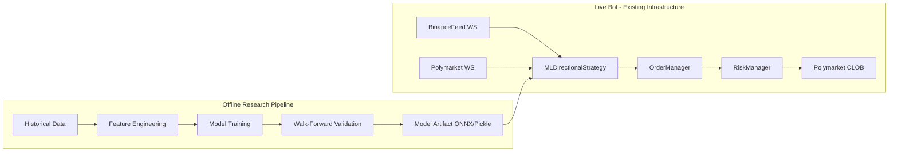

# ML-Driven Directional Edge Strategy for Polymarket BTC Markets

## 0. Architectural Decision: New Module, Not New Repo

**Verdict: New module within `polymarket-bot`.**

The existing bot already has everything the live execution layer needs: `BaseStrategy` pattern, `BinanceFeed` (BTC/ETH/SOL/XRP WebSocket), Kelly sizing (inventory-aware via C kernel), `RiskManager` with circuit breakers and shock tests, `OrderManager` with batch placement, SQLite persistence, Telegram alerts, and TUI dashboard. Reimplementing any of this in a new repo is wasted effort.

The ML component splits cleanly into two concerns:

- **Research/Training pipeline** (`src/ml/`): offline, runs on your machine, produces model artifacts
- **Live strategy** (`src/strategies/ml_directional_strategy.py`): loads trained model, inherits `BaseStrategy`, plugs into existing bot loop




---

## 1. Feasibility Verdict: Honest Assessment

### Can you extract edge from OHLCV alone?

**No. Not meaningfully.** Pure OHLCV on short horizons (5m-1h BTC) yields 50.5-51.5% accuracy in rigorous walk-forward tests. This is below breakeven after Polymarket's dynamic taker fees (~1.56% at 50c, ~3.1% round-trip). Academic papers reporting 55%+ on OHLCV alone almost universally use daily candles, not intraday, and many suffer from lookahead bias or non-purged cross-validation.

### Where does the edge actually come from?

The edge is a **composite of two layers**:

1. **Microstructure alpha (Binance):** Order book imbalance, liquidation cascades, CVD, and funding rate carry genuine short-term predictive power (53-57% directional accuracy on 15m-1h horizons in walk-forward validation). These signals degrade fast -- their alpha halflife is seconds to minutes.
2. **Venue inefficiency alpha (Polymarket):** Polymarket is retail-dominated. Odds lag real-time BTC moves by 5-30 seconds on 5m/15m markets. Your existing `CrossAssetStrategy` already exploits this lag with heuristic probability estimation. An ML model replaces the heuristic `_estimate_probability()` method with a calibrated classifier, producing better probability estimates.

### Realistic edge estimate

- **Model accuracy (walk-forward, 15m-1h):** 53-56% with full signal stack
- **Effective edge after fees:** 1-4% per trade (using maker orders at 0% fee + rebates; note: as of Mar 6, 2026, ALL crypto markets including 1h have taker fees -- maker-only execution is now critical, not optional)
- **Sharpe (annualized, high-frequency):** 0.8-1.5 (not spectacular, but viable at small scale)
- **Capacity ceiling:** ~$50K-100K deployed before moving the market against yourself

### What would invalidate the edge (expanded risk table)


| Assumption                              | How it breaks                                                                             | Severity | Mitigation                                                                                     |
| --------------------------------------- | ----------------------------------------------------------------------------------------- | -------- | ---------------------------------------------------------------------------------------------- |
| Polymarket odds lag BTC by 5-30s        | Other bots close this gap; lag shrinks to <2s                                             | Fatal    | Monitor lag decay weekly; strategy has finite lifespan; accept this                            |
| Microstructure signals are predictive   | Non-stationary; regime changes break correlation                                          | High     | Regime detection; rolling retraining; feature stability checks per fold                        |
| Maker orders fill reliably              | Adverse selection: you get filled disproportionately on the wrong side                    | High     | Track fill-vs-outcome correlation; if fills predict losses, widen maker offset or halt         |
| Fees stay at current structure          | Polymarket changed fees 3 times in 3 months (Jan-Mar 2026); could change again            | Medium   | Fee-aware sizing; dynamic `feeRateBps` fetch per order; Telegram alert on fee endpoint changes |
| Model doesn't overfit                   | Walk-forward accuracy collapses live despite looking good in-sample                       | High     | Three-layer validation protocol (see Section 4); never skip paper trade phase                  |
| Labels match Polymarket resolution      | Contract settles on a different timestamp, price source, or rounding rule than your label | Fatal    | Build labels from the exact contract rule; verify against historical resolutions               |
| Features are available at decision time | Lookahead: using candle close data to trade within that same candle                       | Fatal    | Every feature row must have as-of and availability timestamps; audit before training           |
| Fee/slippage assumptions are realistic  | Backtest assumes 0 slippage and maker fills; reality is worse                             | High     | Model partial fills, missed fills, and spread crossing cost in backtest                        |
| Regime stability                        | Model works in trending regimes, dies in chop/mean-reversion                              | Medium   | ATR-based regime gate; disable in low-vol chop; track per-regime accuracy                      |
| Structural market change                | Polymarket crypto participation shifts after fee introduction; bot competition increases  | Medium   | Monthly edge decay audit; if rolling 100-trade accuracy < 51%, auto-disable                    |


---

## 2. Recommended ML Architecture

### Primary model: LightGBM (gradient-boosted trees)

**Why not deep learning?**

- LightGBM outperforms LSTM/Transformer on tabular microstructure features in every rigorous crypto study (2024-2025)
- 100x faster to train and iterate on
- Interpretable feature importances for debugging
- No GPU required
- LSTM/Transformer excel only when you have raw sequence data (tick streams, L2 order book snapshots) -- which is a Phase 2 upgrade, not Phase 1

**Architecture:**

```python
import lightgbm as lgb

model = lgb.LGBMClassifier(
    objective='binary',
    n_estimators=500,
    max_depth=6,
    learning_rate=0.05,
    subsample=0.8,
    colsample_bytree=0.7,
    min_child_samples=50,
    reg_alpha=0.1,
    reg_lambda=1.0,
    class_weight='balanced',
)
```

**Label:** `1` if `close > open` (UP), `0` otherwise. For noisy flat candles, consider a dead-zone filter: exclude candles where `|close - open| / open < 0.05%` from training.

### Ensemble option (Phase 2)

Per-timeframe models (15m, 1h) with a meta-learner stacking their probabilities. Only pursue after single-model validation.

---

## 3. Feature Pipeline -- Signal Stack Ranked by Expected Alpha

### Tier 1: High-alpha microstructure (implement first)


| Feature                                | Source                  | Expected Alpha | Notes                                                                                   |
| -------------------------------------- | ----------------------- | -------------- | --------------------------------------------------------------------------------------- |
| Order book imbalance (top 5-10 levels) | Binance WS depth stream | Highest        | `(bid_vol - ask_vol) / (bid_vol + ask_vol)` at L1-L10; slope of imbalance across levels |
| Liquidation delta (long vs short)      | Binance WS `forceOrder` | High           | Liquidation clusters precede large moves by 5-30s; long/short ratio is directional      |
| CVD (cumulative volume delta)          | Binance WS aggTrades    | High           | Net buyer-initiated minus seller-initiated volume; 5m/15m rolling windows               |
| Price velocity and acceleration        | Binance WS ticker       | Medium-High    | `price_change_pct_10s`, `price_change_pct_30s`, acceleration (derivative of velocity)   |


### Tier 2: Medium-alpha structural (implement second)


| Feature                         | Source                   | Expected Alpha | Notes                                                                            |
| ------------------------------- | ------------------------ | -------------- | -------------------------------------------------------------------------------- |
| Funding rate                    | Binance REST (8h cycle)  | Medium         | Positive funding = longs pay shorts = crowded long                               |
| Open interest delta             | Binance REST             | Medium         | Rising OI + rising price = genuine trend; rising OI + flat price = squeeze setup |
| Multi-timeframe candle features | Your existing OHLCV data | Medium         | Body/wick ratio, candle direction alignment across 15m/1h/4h, ATR regime         |
| Volatility regime (ATR-based)   | Computed from OHLCV      | Medium         | Signal quality varies by regime; gate model on ATR percentile                    |


### Tier 3: Low-alpha / slow frequency (optional, Phase 2)


| Feature                              | Source                  | Expected Alpha | Notes                                                                             |
| ------------------------------------ | ----------------------- | -------------- | --------------------------------------------------------------------------------- |
| Fear and Greed index                 | alternative.me API      | Low            | Daily granularity; too slow for intraday                                          |
| BTC dominance                        | CoinGecko               | Low            | Regime indicator, not directional signal                                          |
| On-chain exchange inflows            | Glassnode/Arkham (paid) | Low-Medium     | Interesting but latency is minutes-hours, not seconds                             |
| Polymarket implied probability drift | Polymarket WS           | Medium         | Rate of change of Polymarket odds independent of BTC move; retail sentiment proxy |


### Timeframe recommendation

**Skip 5m candles as the primary prediction target** for the ML model. Your existing `CrossAssetStrategy` already handles the 5m latency arb with heuristics and it works because the edge there is speed, not prediction. The ML model should target **15m and 1h** markets where:

- There's more time for the model to generate alpha
- Entry timing is less latency-sensitive
- Features have time to be computed cleanly
- Slippage matters less

Use 4h candles only as a regime/trend filter, not as a prediction target.

**Important fee update (Mar 6, 2026):** 1h markets are no longer fee-free. All crypto horizons now share the same taker fee formula. This eliminates what would have been a fee advantage for 1h over 15m markets. The case for targeting 15m is now purely about signal quality and entry timing, not fee arbitrage.

### Mixed-frequency feature engineering

```python
class FeatureEngine:
    """
    Handles the core challenge: combining tick-rate microstructure data
    with slow candle data into a fixed-width feature vector.
    """
    def compute_features(self, timestamp: float) -> np.ndarray:
        # Fast features (updated every second via WebSocket)
        ob_imbalance_l1_l5 = self.binance.get_ob_imbalance(levels=5)
        ob_imbalance_l1_l10 = self.binance.get_ob_imbalance(levels=10)
        cvd_5m = self.binance.get_cvd(window_s=300)
        cvd_15m = self.binance.get_cvd(window_s=900)
        liq_delta_5m = self.binance.get_liquidation_delta(window_s=300)
        price_vel_10s = self.binance.price_change_pct_10s
        price_vel_30s = self.binance.price_change_pct_30s
        price_vel_60s = self.binance.price_change_pct_60s

        # Medium features (updated per candle close)
        candle_15m = self.ohlcv.latest('15m')
        candle_1h = self.ohlcv.latest('1h')
        body_wick_15m = (candle_15m.close - candle_15m.open) / (candle_15m.high - candle_15m.low + 1e-8)
        rsi_15m = self.indicators.rsi(period=14, tf='15m')
        atr_1h = self.indicators.atr(period=14, tf='1h')

        # Slow features (updated every 8h or daily)
        funding_rate = self.binance.funding_rate
        oi_delta_1h = self.binance.oi_change_pct_1h

        return np.array([
            ob_imbalance_l1_l5, ob_imbalance_l1_l10,
            cvd_5m, cvd_15m,
            liq_delta_5m,
            price_vel_10s, price_vel_30s, price_vel_60s,
            body_wick_15m, rsi_15m, atr_1h,
            funding_rate, oi_delta_1h,
            # ... additional features
        ])
```

---

## 4. Validation, Leakage Control, and Backtesting

This section determines whether the strategy is real.

### Leakage control non-negotiables

These are not optional hygiene steps. Violating any one of them invalidates all results.

- Build labels from the **exact Polymarket contract resolution rule and timestamp convention**, not generic "next candle green/red" unless that is truly the settlement rule.
- Every feature row must have an **as-of timestamp** and a **feature availability timestamp**. If a feature was not observable at decision time, it cannot be used.
- Slow features (funding rate, OI) must be **forward-filled only from when they were actually published**. Funding rate updates every 8h -- you cannot use the next update retroactively.
- Multi-timeframe candles must be computed using **only data from candles closed before decision time**. You cannot use the 1h candle close to trade within that same 1h Polymarket market.
- If you use the final minutes of a candle to trade that same candle's Polymarket market, you must model the reduced time-to-fill and end-of-window slippage explicitly.

### Three-layer validation stack

Use all three layers, not just one:

1. **Expanding-window walk-forward** as the main estimate of deployable performance. Train on months 1-N, test on month N+1. Minimum 12 test windows.
2. **Purged / embargoed time-series CV** inside each training set for model selection and threshold tuning. Purge 2x the prediction horizon around fold boundaries. Embargo 1x the prediction horizon after each test fold.
3. **Final untouched holdout** from the latest regime (most recent 2-3 months). This is the last check before paper trading. If this fails, nothing else matters.

### Stationarity and stability checks

- Run ADF test on feature distributions per fold. If a feature becomes non-stationary across folds, it is unreliable.
- Track top-5 feature importances across folds. If they shuffle dramatically, the model is fitting noise, not structure.

### What to optimize (primary vs secondary metrics)

**Primary metrics (these decide go/no-go):**

- Net EV per trade after fees, slippage, and missed-fill penalty
- Brier score / calibration error (is `p_model = 0.60` actually right 60% of the time?)
- Precision and recall in the **"trade" region only** (where model actually fires, not across all samples)
- Profit factor after simulated Polymarket fees
- Max drawdown in walk-forward simulation

**Secondary metrics (informational, not decisive):**

- Raw accuracy
- ROC-AUC

If your best result says "54% accuracy" without calibration error and net EV after frictions, the model is not production-ready.

### What "passing" looks like

- Walk-forward accuracy > 53% across **all** test folds (not just average)
- No individual fold below 50.5%
- Brier score < 0.25 (well-calibrated probabilities)
- Feature importances stable across folds (top 5 features don't shuffle order)
- Profit factor > 1.3 after simulated Polymarket fees and realistic fill assumptions
- Net EV per trade > 1.5 cents after all frictions at the "trade" threshold

### What "failing" looks like (stop and reassess)

- Average accuracy 51-52% with high variance across folds
- Any fold below 50%
- Feature importances change dramatically per fold
- In-sample accuracy 65%+ but walk-forward accuracy 52% (classic overfit)
- Profit factor < 1.0 after fees (you are losing money)
- Calibration shows model confident at 60% but actual win rate is 52%

### Tools

```
scikit-learn     (purged CV, metrics, calibration)
lightgbm         (model)
pandas / numpy   (features)
mlfinlab          (purged k-fold, triple barrier labels) -- optional
optuna            (hyperparameter tuning with time-series CV)
```

---

## 5. Mispricing Detection on Polymarket

### Fee reality check (verified March 6, 2026)

As of today, **all crypto markets on Polymarket have taker fees** -- including 1h, 4h, daily, and weekly markets which were fee-free until today. The fee formula is identical across all crypto horizons:

```
effective_taker_fee_rate = 0.25 * (p * (1 - p))^2
```

**Verified fee table from Polymarket docs (crypto markets):**


| Price     | Effective Taker Fee Rate | Breakeven Accuracy (taker) | Breakeven Accuracy (maker)    |
| --------- | ------------------------ | -------------------------- | ----------------------------- |
| 10c / 90c | 0.20%                    | ~50.2%                     | ~50% + uncertainty buffer     |
| 20c / 80c | 0.64%                    | ~50.6%                     | ~50% + uncertainty buffer     |
| 30c / 70c | 1.10%                    | ~51.1%                     | ~50% + uncertainty buffer     |
| 40c / 60c | 1.44%                    | ~51.4%                     | ~50% + uncertainty buffer     |
| **50c**   | **1.56%**                | **~51.6%**                 | **~50% + uncertainty buffer** |


The "breakeven accuracy (maker)" column says "uncertainty buffer" instead of 0% because maker orders have hidden costs: adverse selection (you get filled more on losing trades), queue priority loss, and missed fills on winning trades. A realistic maker adverse-selection cost is 0.5-1.5%, making the effective breakeven ~51-52% even as a maker.

**Fee rollout timeline (for awareness of trajectory):**

- Jan 19, 2026: 15m crypto markets
- Feb 12, 2026: 5m crypto markets
- **Mar 6, 2026 (today): 1h, 4h, daily, weekly crypto markets**
- Direction: Polymarket is expanding fees, not contracting them. Budget for further increases.

### Friction-aware mispricing detection

The trade should fire only when model probability exceeds a **friction-adjusted threshold**, not just raw fee.

Friction includes:

1. **Taker fee** (if crossing spread) or **adverse-selection cost** (if maker)
2. **Spread crossing cost** (half-spread if you need to improve price for fill)
3. **Missed-fill probability** (maker orders that don't fill on winning trades are invisible losses)
4. **Model calibration uncertainty** (if Brier score shows model overestimates its own accuracy, widen the buffer)

```python
def compute_edge_threshold(market_price: float, execution_mode: str = "maker") -> float:
    """
    Minimum model-vs-market edge required to trade.

    Returns edge in probability points (e.g., 0.04 = 4 cents).
    """
    taker_fee_rate = 0.25 * (market_price * (1 - market_price)) ** 2

    if execution_mode == "taker":
        fee_cost = taker_fee_rate
    else:
        fee_cost = 0.0  # maker pays 0, but...

    adverse_selection_estimate = 0.01  # ~1% adverse selection on maker fills
    spread_cost = 0.005               # half a cent for resting near best bid
    missed_fill_penalty = 0.005       # expected cost of winning trades that didn't fill
    calibration_buffer = 0.01         # uncertainty in model probability estimates

    return fee_cost + adverse_selection_estimate + spread_cost + missed_fill_penalty + calibration_buffer


def is_mispriced(model_prob: float, market_price: float, side: str) -> bool:
    edge = (model_prob - market_price) if side == "BUY" else (market_price - model_prob)
    threshold = compute_edge_threshold(market_price, execution_mode="maker")
    return edge > threshold
```

**Practical thresholds by price zone:**


| Price zone   | Maker threshold | Taker threshold | Interpretation                                             |
| ------------ | --------------- | --------------- | ---------------------------------------------------------- |
| Near 50c     | ~3.0 cents      | ~4.5 cents      | Hardest zone: high fee, most uncertainty, most competition |
| Near 40c/60c | ~3.0 cents      | ~4.5 cents      | Slightly easier: fee drops but so does signal quality      |
| Near 30c/70c | ~3.0 cents      | ~4.1 cents      | Better risk/reward: lower fee, direction more certain      |
| Near 20c/80c | ~3.0 cents      | ~3.6 cents      | Late-entry zone: if edge is real here, take it             |


**Conservative guidance from the other roadmap (still valid):**

- **Absolute edge below ~3 percentage points is usually noise after frictions.**
- **Practical deployment threshold starts around 4-6 points of model-vs-market probability gap.**
- **For aggressive late-entry trades in thin books, you may need 6-10 points to survive live execution.**

Kelly should be computed on **fee-adjusted fair odds**, not raw predicted probability.

---

## 6. Order Timing and Execution

### Optimal entry timing by market duration


| Market | Optimal Entry                                                     | Rationale                                                                            |
| ------ | ----------------------------------------------------------------- | ------------------------------------------------------------------------------------ |
| 5m     | T-30s to T-10s before close                                       | Direction ~85% determined; odds lag. Your `CrossAssetStrategy` already handles this. |
| 15m    | T-120s to T-30s before close                                      | More time for model to confirm; still exploits slow repricing                        |
| 1h     | Mid-candle (T-30min to T-10min) when high-confidence signal fires | Early enough to capture full move; late enough for signal quality                    |


### Execution approach

- **Post-only maker orders** (0% fee + rebates). Set price at `best_bid + 0.005` for BUY signals.
- **Avoid taker crossing** unless edge > 5 cents and time pressure is extreme (T-10s on 5m market).
- Your existing `order_manager.place_limit_order()` with `order_type="GTC"` handles this.
- For 15m/1h markets, consider `GTD` (good-till-date) with expiry at candle close minus 60s.

### Latency requirements

This is **not** an HFT strategy. You're predicting direction over 15m-1h windows and placing maker orders. Required latency:

- **Model inference:** < 50ms (LightGBM on CPU is < 1ms for single prediction)
- **Order placement RTT:** < 500ms is fine for 15m/1h markets
- **WebSocket data feed latency:** < 200ms to Binance is acceptable
- **Total signal-to-order pipeline:** < 1s is sufficient

---

## 7. Infrastructure and Latency

### Python is sufficient

The entire pipeline can stay in Python. The bottleneck is not compute -- LightGBM inference is <1ms, feature computation is <5ms. The bottleneck for the ML strategy is signal quality, not speed. Your existing C kernel (`pmkernel`) handles the compute-heavy Kelly/Greeks math already.

**Do not rewrite in Rust** for this strategy. It's premature optimization. If you later find fill rates are the bottleneck (not prediction quality), then consider Rust for the order placement hot path only.

### Testing from Sao Paulo: viable for development


| Phase                               | Location                            | Acceptable? | RTT to Polymarket (US East) | RTT to Binance (Tokyo/Singapore) |
| ----------------------------------- | ----------------------------------- | ----------- | --------------------------- | -------------------------------- |
| Research + backtest                 | Sao Paulo (local)                   | Yes         | N/A                         | N/A                              |
| Paper trading                       | Sao Paulo (local)                   | Yes         | ~170-200ms                  | ~250-300ms                       |
| Live (small bankroll, 15m+ markets) | Sao Paulo (local)                   | Marginal    | ~170-200ms                  | ~250-300ms                       |
| Live (production)                   | VPS (AWS us-east-1 or eu-central-1) | Required    | <5ms                        | <100ms                           |


**Real risks from Sao Paulo during testing:**

- WebSocket disconnects during resolution windows (mitigated by reconnect logic you already have)
- Order placement at T-30s on 15m markets is fine; at T-10s on 5m markets, 200ms matters
- Binance depth/liquidation data arrives 200ms late -- for 15m+ markets, this is not material

**VPS recommendation for production:** AWS `us-east-1` (Virginia) on a `c6i.xlarge` (~$125/month). This gives <5ms to Polymarket and <80ms to Binance Tokyo via AWS backbone. Equinix is overkill for this strategy.

---

## 8. Strategy Identity and Classification

### Formal name

**"Cross-venue microstructure-informed directional arbitrage on retail prediction markets"**

Or more concisely: **"ML Directional Edge"** (`ml_directional` as strategy name in code).

### Related literature

- Cartea, Jaimungal, Penalva (2015) -- *Algorithmic and High-Frequency Trading*, Chapter 10 (cross-venue signals)
- Lopez de Prado (2018) -- *Advances in Financial Machine Learning* (purged CV, feature importance, meta-labeling)
- Cont, Kukanov, Stoikov (2014) -- *"The Price Impact of Order Book Events"* (OBI predictive power)
- Snowberg, Wolfers, Zitzewitz (2011) -- *"How Prediction Markets Can Save Event Studies"* (cross-asset info flow to prediction markets)
- Zhang et al. (2024, IEEE) -- *"Predicting Price Movement using LightGBM Classification for Cryptocurrency Trading"* (LightGBM outperforms alternatives on crypto OHLCV+indicators)

### Closest known implementations

- Wintermute, Citadel Securities (crypto market making with microstructure signals)
- Various Polymarket arbitrage bots documented in 2024-2025 (taker arb, now mostly dead after Feb 2026 fee changes)
- Your existing `CrossAssetStrategy` is the closest analog -- the ML strategy is a direct upgrade of its `_estimate_probability()` heuristic

---

## 9. Bankroll and Risk Management

### Minimum viable bankroll


| Phase                 | Bankroll       | Reasoning                                                                                                           |
| --------------------- | -------------- | ------------------------------------------------------------------------------------------------------------------- |
| Paper trading         | $0 (simulated) | Validate model accuracy and fill simulation                                                                         |
| Live testing          | $500-1,000     | ~50-100 trades at $5-10 each; enough for basic statistical validation (but not significance)                        |
| Meaningful validation | $2,000-5,000   | ~200-500 trades needed for 95% confidence that edge > 0; Kelly sizing allows larger bets on high-confidence signals |
| Scaling               | $5,000-25,000  | Only after 300+ live trades with verified edge > 2%                                                                 |


### Position sizing: Fractional Kelly (conservative start)

**Start at 0.10x-0.25x Kelly, not half-Kelly.** Half-Kelly is appropriate when you *know* the edge. Here, the edge is *estimated* from a model with uncertain calibration, on non-stationary markets, with execution assumptions that haven't been validated live. Quarter-Kelly is aggressive enough for the testing phase.

Scale up to half-Kelly only after 200+ live trades confirm the calibration holds.

```python
result = kelly_size(
    estimated_prob=model_output,       # 0.57
    market_price=polymarket_mid,       # 0.52 -- use fee-adjusted fair price
    bankroll=current_bankroll,
    mode="quarter",                    # 0.25x Kelly during validation; "half" after 200+ confirmed trades
    max_bet_usd=max_trade_size,
    inventory_q=current_position_shares,
)
```

**Hard caps on top of Kelly (non-negotiable):**

- Max single trade: 3% of bankroll
- Max exposure per market: 5% of bankroll
- Max concurrent BTC directional exposure (all markets, same direction): 10% of bankroll
- Max single trade as fraction of visible book depth: 20% of top-5-level liquidity (avoid moving the market)

### Circuit breakers (existing RiskManager + ML-specific)

**Existing bot circuit breakers (keep as-is):**

- Daily loss limit: 5% of bankroll (`daily_loss_limit_pct`)
- Drawdown halt: 12% max drawdown (`drawdown_halt_pct`)
- Drawdown throttle: progressive size reduction from 1.0x to 0.25x as drawdown increases

**ML-specific circuit breakers (add to `MLDirectionalStrategy`):**

- **Rolling accuracy monitor:** If accuracy drops below 51% over rolling 100 trades, auto-disable strategy and alert via Telegram. Do not re-enable without manual review and retraining.
- **Consecutive loss limit:** After 7 consecutive losses, pause for 2 hours. After 10 consecutive losses, pause for 24 hours. (Expected consecutive losses at 55% accuracy: 7 in a row has ~0.2% probability per 100-trade window -- rare enough to signal a problem.)
- **Calibration drift monitor:** Track rolling Brier score over 50-trade windows. If Brier score exceeds 0.26 (worse than naive 50/50), halt and retrain.
- **Regime filter:** If 1h ATR is in top 5th percentile (black swan / flash crash regime), disable strategy entirely. These are not the regimes your model was trained to predict.
- **Data feed desync halt:** If Binance WebSocket disconnects or Polymarket feed goes stale (>10s without update), cancel all pending orders and halt until feeds are healthy for 30s.
- **Adverse selection detector:** Track fill rate on winning vs losing trades over rolling 50-trade window. If fills on losing trades exceed fills on winning trades by >20%, widen maker offset or halt.

### Main risks of ruin

1. **Model decay without detection:** Edge disappears but you keep betting. Mitigation: rolling accuracy + calibration monitors with auto-disable.
2. **Adverse selection on maker orders:** You get filled disproportionately on wrong-side bets. Mitigation: fill-vs-outcome tracking; widen maker spread or switch to selective taker if adverse selection is confirmed.
3. **Polymarket fee structure change:** Three fee changes in three months (Jan-Mar 2026). Trajectory is toward more fees, not fewer. Mitigation: dynamic `feeRateBps` fetch per order; Telegram alert on fee endpoint changes; monthly edge recalculation.
4. **Correlated losses during BTC flash crashes:** 10+ consecutive losses are possible in extreme moves. Mitigation: quarter-Kelly + consecutive loss circuit breaker + ATR regime gate.
5. **Miscalibrated probabilities:** Model says 60% but true rate is 52%. Mitigation: Platt scaling or isotonic regression on validation fold; rolling Brier score monitor live.
6. **Late-candle non-fills followed by stale chases:** Maker order doesn't fill before resolution, you chase with taker at worse price. Mitigation: strict GTD expiry (candle close minus 60s); never chase a missed fill.

---

## 10. Prioritized 6-Step Action Plan

### Step 1: Data Pipeline and Feature Engineering (Week 1-2)

Build the offline feature computation pipeline using your existing BTC OHLCV data (www/polymarket-bot/data/ml/ohlc/btc/) 15m, 1h, 4h, 1d. source: kaggle 'bitcoin-historical-datasets-2018-2024'. Newer ohlcv data can be downloaded from Kaggle (api keys already on env) periodically via api. Dataset: [https://www.kaggle.com/datasets/novandraanugrah/bitcoin-historical-datasets-2018-2024/](https://www.kaggle.com/datasets/novandraanugrah/bitcoin-historical-datasets-2018-2024/) .link says -2024 but the title is wrong, it has live data). For microstructure features (OBI, CVD, liquidations), you'll need to collect these from Binance WebSocket for 2-4 weeks before you have enough for training. Start collection immediately.

**Files to create:**

- `src/ml/__init__.py`
- `src/ml/features.py` -- feature computation from OHLCV + (later) microstructure
- `src/ml/data_loader.py` -- load and normalize your existing CSVs
- `src/ml/collectors/binance_depth.py` -- WebSocket collector for OBI/CVD/liquidations, persists to SQLite

### Step 2: Model Training and Walk-Forward Validation (Week 2-4)

Train LightGBM on OHLCV-derived features first (body/wick ratio, multi-TF momentum, ATR regime, time-of-day). This will establish the baseline (expect ~51-52% accuracy). Then incrementally add microstructure features as data accumulates.

**Files to create:**

- `src/ml/train.py` -- training pipeline with purged walk-forward CV
- `src/ml/evaluate.py` -- metrics, fold analysis, feature importance plots
- `src/ml/model.py` -- model wrapper with `.predict_proba()` interface

### Step 3: Backtest Against Polymarket Historical Data (Week 3-5)

Use your existing `PolyBackTest` schema (which has `snapshots` with `btc_price`, `price_up`, `price_down`, `orderbook_json`) to simulate the full signal-to-execution pipeline. This tests not just model accuracy but the complete edge: model prediction -> mispricing detection -> order placement -> fill simulation -> P&L.

**Files to create:**

- `src/ml/backtest.py` -- replay engine using PolyBackTest data + model predictions

### Step 4: Live Strategy Integration (Week 4-6)

Create `MLDirectionalStrategy` inheriting `BaseStrategy`. Wire it into the bot's strategy registry. Paper trade for 2+ weeks.

**Files to create:**

- `src/strategies/ml_directional_strategy.py` -- the live strategy
- Config entries in `src/config.py` for ML-specific parameters

### Step 5: Paper Trading and Validation (Week 6-8)

Run paper trading with `PAPER_TRADING=true`. Target 200+ simulated trades. Track:

- Accuracy per timeframe (15m, 1h)
- Fill rate and adverse selection ratio (simulated)
- Net EV per trade after fees and estimated slippage
- Brier score / calibration error (rolling 50-trade windows)
- Drawdown profile
- Feature importance stability vs. walk-forward training

**Pass criteria (all must hold):**

- Walk-forward accuracy > 53% on 15m AND > 52% on 1h over 200+ trades
- Net EV per trade > 0 after friction model (fees + spread + adverse selection estimate)
- Brier score < 0.25 (model probabilities are well-calibrated)
- No 50-trade window with accuracy < 48% (catastrophic regime failure)
- Profit factor > 1.2 after all simulated frictions

**Fail criteria (any one triggers reassessment):**

- Accuracy < 51% on either timeframe
- Max drawdown > 15%
- Brier score > 0.26 (model overconfident)
- Net EV per trade < 0 after frictions (strategy loses money even if "accurate")

### Step 6: Live Deployment (Week 8+)

Deploy with $500-1,000, **quarter-Kelly** sizing, all circuit breakers active. Monitor for 200+ trades before scaling Kelly fraction or bankroll. Move to VPS when slippage or fill rate becomes the bottleneck. Promote to half-Kelly only after rolling accuracy > 53% and Brier < 0.25 are confirmed over 200+ live trades.

---

## Appendix: What to Skip

- **5m markets as ML target:** Your existing `CrossAssetStrategy` handles this with speed, not prediction. Don't cannibalize it.
- **Deep learning (Phase 1):** LightGBM is faster to iterate and equally accurate on tabular features. Revisit LSTM only if you later collect raw L2 order book sequences.
- **On-chain data:** Too slow for intraday. Interesting for daily/weekly models only.
- **Fear and Greed / sentiment:** Too noisy and lagged for 15m-1h predictions.
- **Rust rewrite:** Premature. Python is not the bottleneck.
- **New repo:** You'd waste weeks reimplementing infrastructure that already works.

